# For attendees
This hands-on lab will show you how the machine learning workflow naturally fits into your general software development practice, how cross-functional teams build intelligent applications, and how the serverless capabilities of OpenShift 4 enable agile, efficient, and economical data and learning pipelines. Using an open-source stack, we'll show you:

- how OpenShift streamlines the path from discovery to production for data scientists and developers alike;
- the advantages of serverless for machine learning systems;
- how to train, evaluate, and publish models in a contemporary serverless architecture;
- how to monitor models in production, and detect failures before they cause problems; and
- how to start incorporating intelligent features into your apps.

You'll get the opportunity to develop your own fraud detection model and in doing so you'll see how data scientists work, how models are trained and how to put machine learning models into production.

You'll see how to take advantage of the serverless capabilities of OpenShift 4 to make your fraud detection model part of a scalable, intelligent application. 

Application developers will leave this session equipped to build apps that depend on machine learning; machine learning engineers and data scientists will leave this session prepared to take full advantage of OpenShift 4 for their daily work. 

All attendees will develop an understanding of how OpenShift supports both data science discovery and production machine learning systems.

Let's get started! 
 
 
## Background and workshop flow

In order to run this workshop you'll need to know your _username_ and _password_. These should be given to you by the lab instructor. You'll also need an OpenShift Console URL. 

Visit the URL you are given by the instructor, and enter your _username_ and _password_, then click `Log In` you will be taken to a page that looks something like this: 

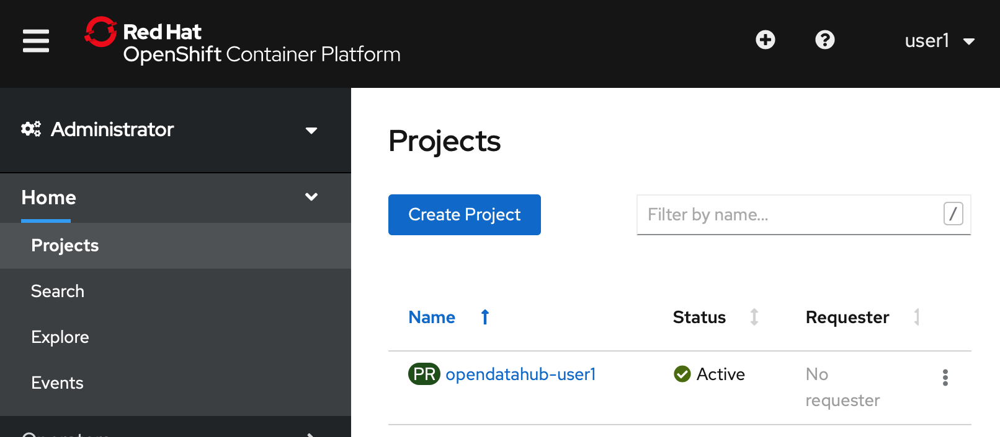

__(Note that your project name and the username in the top right hand corner will differ from what you see here, reflecting your username instead.)__

Go ahead and click on your project name to access your personal project:

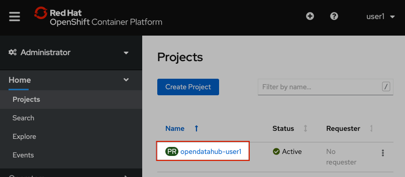 

#### Accessing JupyterHub

JupyterHub is an interactive development environment which serves Jupyter Notebooks. We will use it today for exploratory data anlysis and model development.

JupyterHub is running in your OpenShift project and you can access it as follows: In the left-hand side of the OpenShift Console, visit `Networking -> Routes`. You'll see a bunch of URLs for different exposed services within your OpenShift project. Go ahead and click on the URL corresponding to `JupyterHub`.

You will be taken to a page asking you to 'Sign in with OpenShift'. Go ahead and click that big orange button.

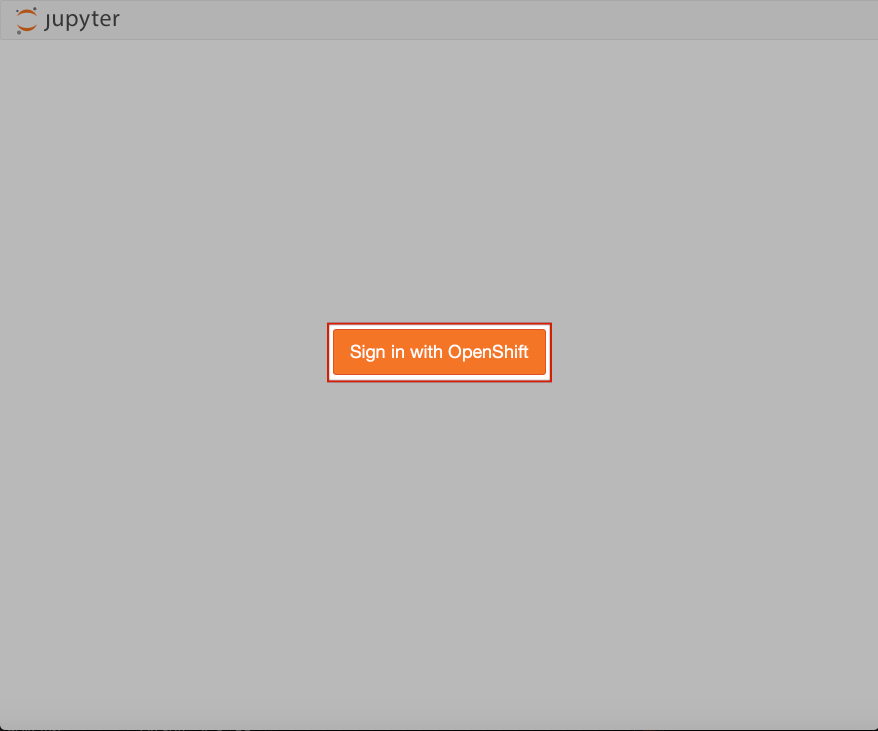

You will then be asked to enter your _username_ and _password_ again. (These are the same as before!)

You will then be asked to authorise some requested permissions. Once you've authorised access, you'll see the JupyterHub Spawner Options screen:

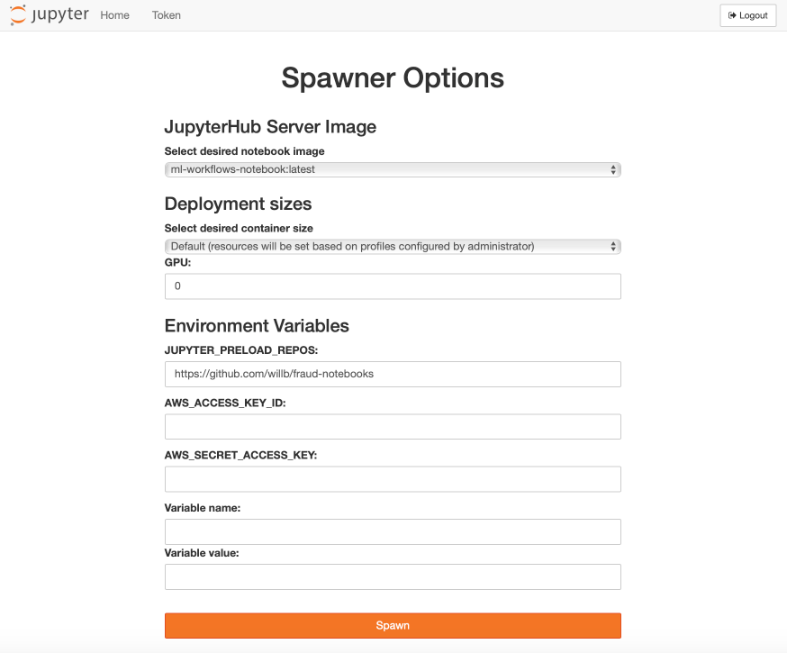

**All these variables have been pre-set to the correct values for you, so do not change any spawner options.**

From top to bottom, the variables on this page are:

* an image to run our environment in. Notebook images contain pre-loaded libraries. For today's workshop this should be set to `ml-workflows-notbook:latest`. 
* t-shirt sizing for the environment. Make sure you keep this as `Default`, else you won't be able to run the notebooks.
* the number of GPUs you want to use. (We don't have any GPUs on the cluster we're working on today, so keep this at `0`!)
* Environment variables relating to the persistent volume which JupyterHub creates in our project:
	1.  the location of a git repo containing the notebooks you want to clone into your persistant volume. The repo for this workshop is https://github.com/willb/fraud-notebooks. 
	2. secrets and access keys for any other storage you wish to connect to. (This should be left blank.)
	3. any extra variable names you want to specify. (This should also be left blank.)
	
Go ahead and click `Spawn`. JupyterHub will set up that environment for you. This may take a few minutes and whilst the environment is spawning you will see a loading bar like this: 

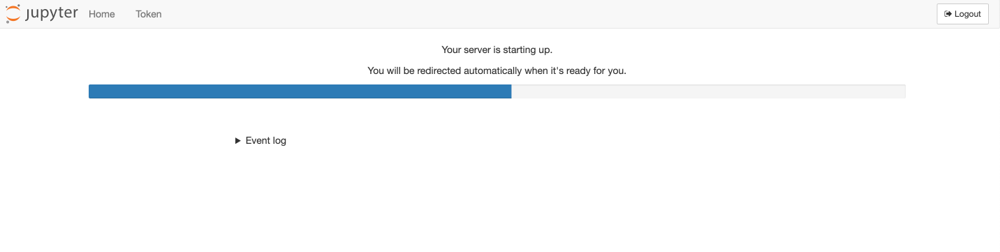

You're now inside your JupyterHub instance, within your own OpenShift project. The notebooks we will be working with today are in the `fraud-notebooks` folder, so go ahead and click on that. 

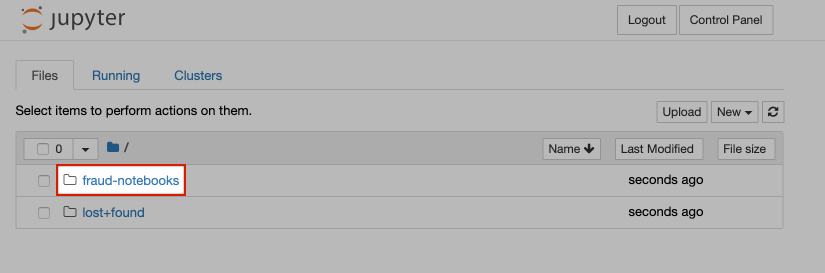

If you haven't used Jupyter notebooks before, or are in need of a Jupyter notebook refresher, you should spend some time working through notebook `00-getting-started.ipynb`. It will step you through how to interact with Jupyter notebooks, and how to reset your notebooks if you get really stuck. 

Once you're confident interacting with this Jupyter notebook you are ready to start on the fraud detection use case! 

#### Exploratory Data Science

The notebooks you'll work through today are numbered in order and (for the most part) you'll need to run them in order. Here's how to step through the notebooks:

- `01-eda.ipynb` steps through some exploratory data analysis, allowing you to gain insight into the transactions data you will be working with today. You'll also inspect and transform some of the data.
- `02-feature-engineering.ipynb` shows how to turn the transactions data into feature vectors. You'll transform each entry in the data set into numeric vector, whilst aiming to capture important information about the data. You will visualise these vectors to indicate if it is possible to identify any structure in the data that differentiates the legitimate transactions from the fraudulent ones.

**At this point in the workshop you can choose which type of model you train.** 
We have a `logistic regression model` and a `random forest model` for you to choose from. 

- `03-model-logistic-regression.ipynb` shows how to train a logistic regression model to distinguish between fraudulent and legitimate transactions; and
- `03-model-random-forest.ipynb` shows how to train an ensemble of decision trees to distinguish between fraudulent and legitimate transactions.

If you want, you can train both of the models, but whichever model you trained last will be read in by the next notebook. 

Congratulations! You've now stepped through training a model. 

We will now use OpenShift to deploy this model as a service, but before we can do this we need to log into into the OpenShift Console.

In this section you will learn how to use OpenShift Pipelines to build a RESTful service for making predictions, using the model you just trained.

#### Accessing the build pipeline

Return to the OpenShift console, using the URL you were given. 

In the sidebar menu, navigate to the "Pipelines" section and open the "Pipelines" subsection.
You should see now the build pipeline. 

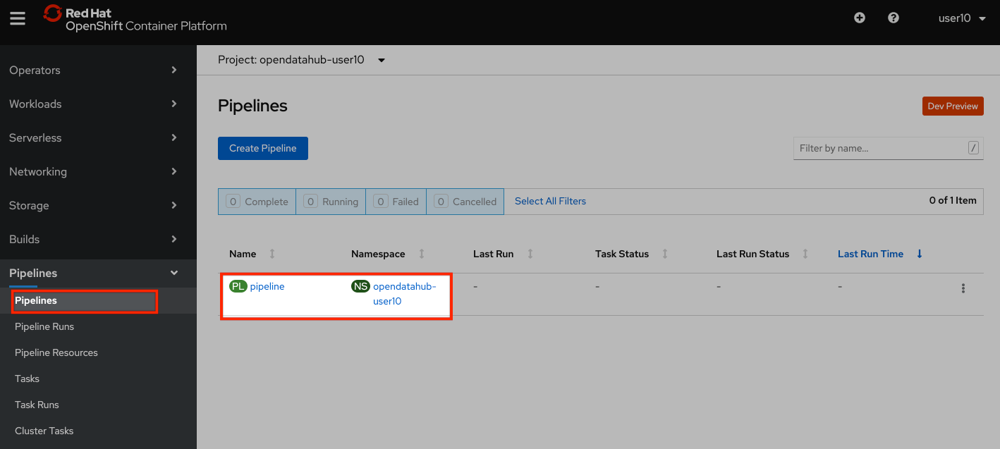
Click on the pipeline to inspect its definition. 
A build pipeline is made of one or more tasks. 
For this lab, we will run a build pipeline with two tasks running sequentially:

* a task that will build a container image that contains the model we trained and push it to an OpenShift Image Stream;
* a task that will deploy a service using OpenShift Serverless

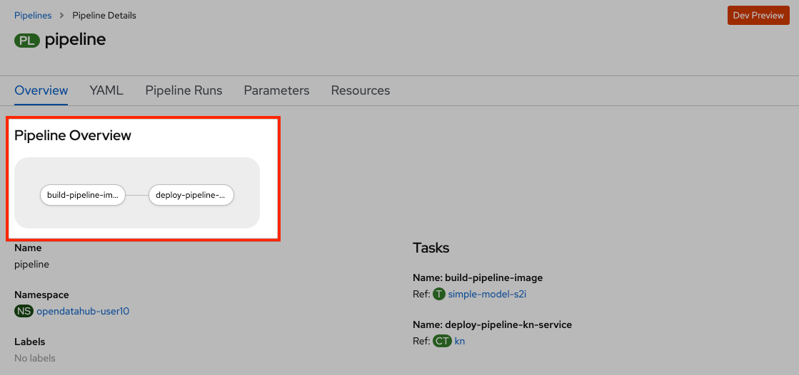
Now you can return to the previous menu, and start the pipeline.

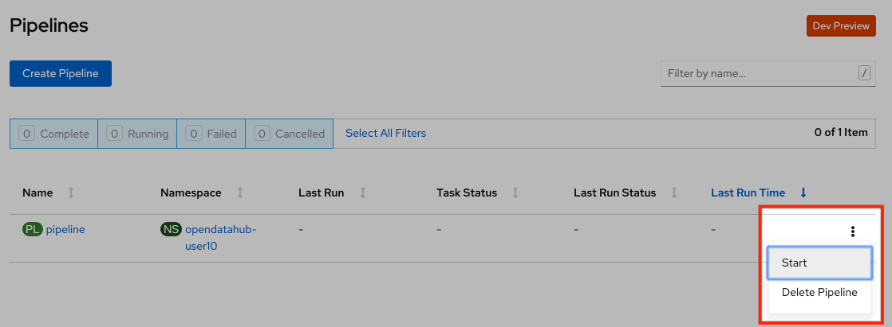
You will be prompted with the pipeline run parameters, which should look like in the picture below.

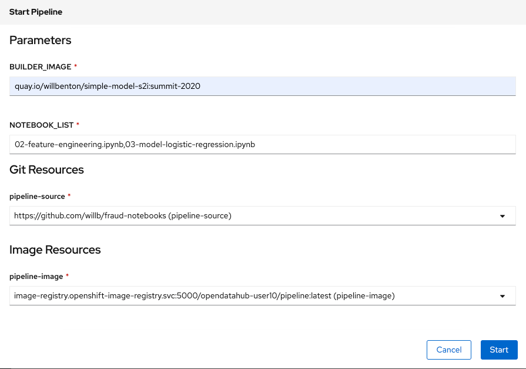
Confirm that the values are correct, then press "Start".
As the pipeline runs, the OpenShift console will display the progress of the pipeline tasks. 
You can click on the running task to inspect the logs.

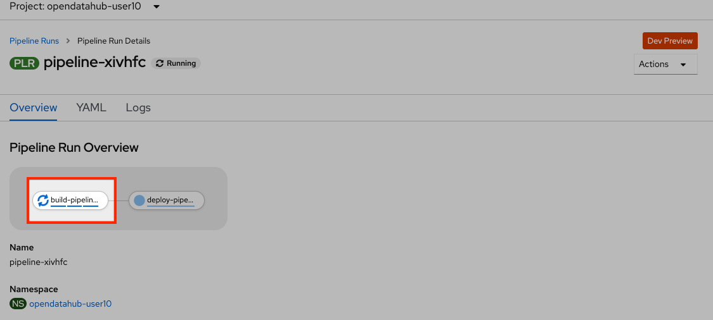

The log screen should look as follows:

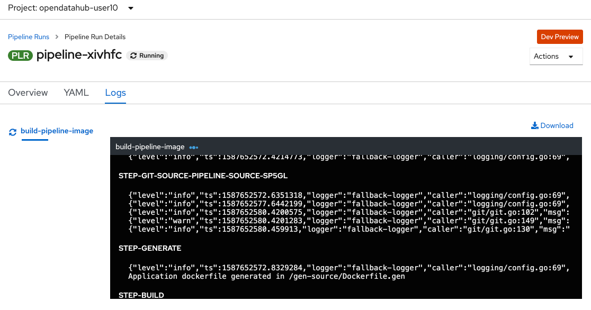

Wait until the build pipeline completes.
It can take a few minutes. 
Once it does, "Ready to serve" will appear in the logs, and you can proceed to inspect your newly deployed service.

### Accessing the Model Service

After the build pipeline has completed, you should have a serverless service deployed in your project.

You can see it by navigating to the Serverless section in the side menu.

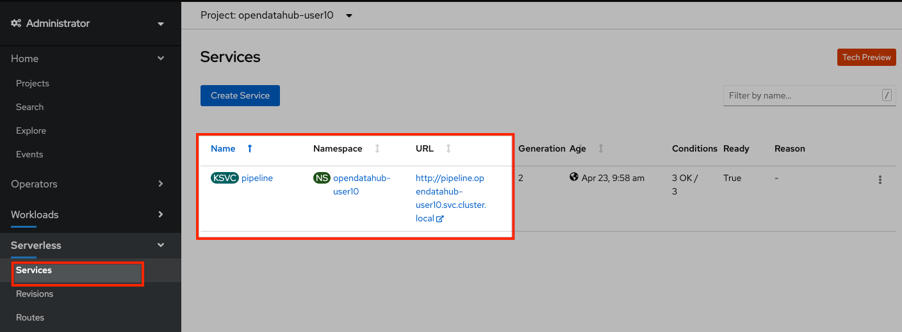
Make note of your service URL. 
It should look like `http://pipeline.opendatahub-{USERNAME}.svc.cluster.local`.
This is the URL that you will use for the next step, for which you will return to JupyterHub.

__(Note that this service is only visible from within the cluster, so you won't be able to access it in the browser.)__

#### Making Predictions Using the Model Service

Congratulations!
You have successfully built and deployed a service that makes predictions based on the model you trained earlier.
Now you can return to JupyterHub and open the `04-services.ipynb` notebook, which will walk you through a few scenarios where you can invoke this service, and show you how to monitor the service with OpenShift. 

#### Overview 
Congratulations! You're now ready to go out into the world and make serverless, intelligent applications. You have seen: 

- how OpenShift streamlines the path from discovery to production for data scientists and developers alike,
- the advantages of serverless for machine learning systems,
- how to train, evaluate, and publish models in a contemporary serverless architecture,
- how to monitor models in production and detect failures before they cause problems, and
- how to start incorporating intelligent features into your apps.

To find out more about AI and ML at Red Hat, take a look these links:

* [The Open Data Hub project](https://opendatahub.io/)
* [Next.redhat.com articles](https://next.redhat.com/category/ai-machine-learning/)

